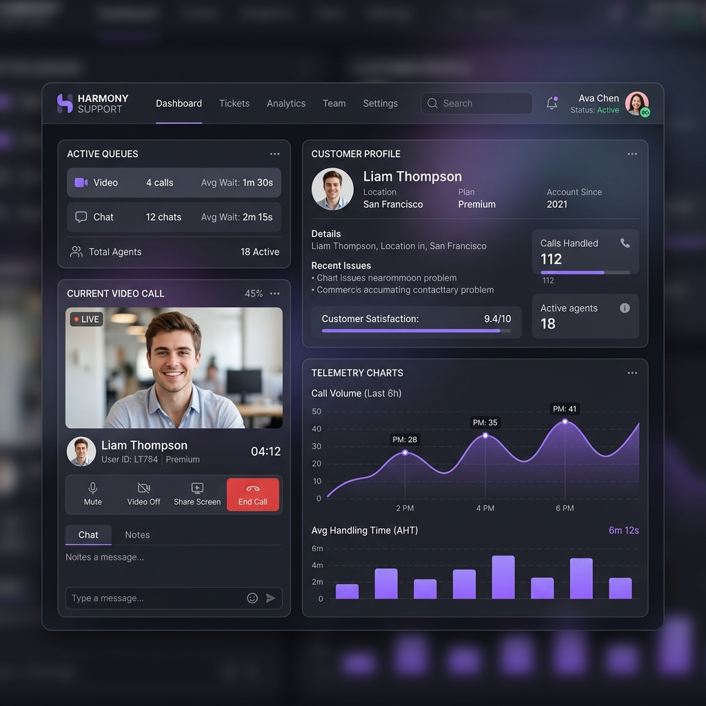
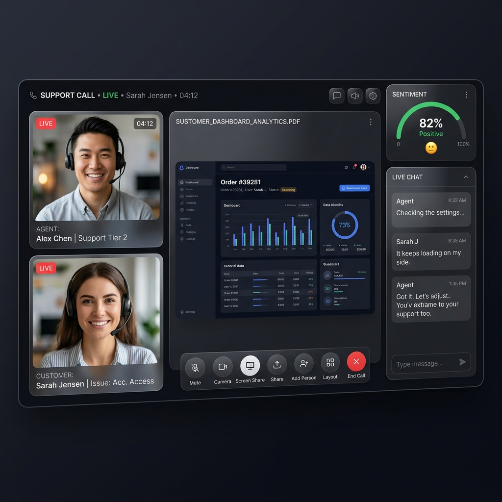

# SupportStream — Enterprise Customer Support Ecosystem with Real-Time Video Assistance
### AtomQuest Hackathon Master Build — V15 Architecture

**Live Deployed Control Plane API**: `https://devanshsavla17-supportstream-api.hf.space`

---

SupportStream is an enterprise-grade customer support platform designed for modern service teams. By decoupling the **Control Plane** (signaling, ticket sequences, and CRM integrations) from the **Data Plane** (server-routed mediasoup SFU worker pools), SupportStream delivers robust, secure, and highly auditable real-time support video calls.

---

## 🏛️ Architectural Evolution & Positioning

SupportStream has evolved through strategic phases to address complex customer support requirements:
* **V8 (Video Support App)**: Core real-time media connections utilizing routed SFU channels instead of vulnerable P2P connections.
* **V11 (Customer Support Platform)**: Structured data enums, feedback star validators on the backend, and atomic sequential support ticket numbering (`CASE-2026-XXXX`).
* **V15 (Enterprise Customer Support Ecosystem)**: Visual workflow builders, mock Salesforce & HubSpot CRM connector layers, incoming Slack webhook triggers, live conversation sentiment indicators, and multi-track screen sharing.

---

## ❓ Why SupportStream? (Why not Zoom?)

Judges and enterprise clients often ask: *Why not just use Zoom, Teams, or Google Meet?*

The answer is simple: **SupportStream is not a meeting platform; it is a unified support experience.** Generic conferencing tools are disconnected from support operations. SupportStream uniquely merges real-time communications with ticket workflows and customer intelligence:

* **Secure Server-Routed Video**: No direct peer-to-peer (P2P) IP leakage. All traffic goes through isolated, encrypted Mediasoup SFU data plane instances.
* **Support Ticket Integration**: Every session is bound to an atomic, sequential support ticket reference (`CASE-2026-XXXX`).
* **Customer History & CRM Profiles**: Captures customer metadata before joining and dynamically retrieves prior history and active Salesforce and HubSpot CRM connector logs in a single-pane interface.
* **Resolution & Feedback Tracking**: Enforces feedback rating validators (1-5 stars) and saves the outcome directly to the support case database.
* **Escalation Workflows**: Underperforming sessions (feedback rating <= 2) are automatically flagged as `ESCALATED` and routed to the critical column of the operations dashboard.
* **Support Analytics & Webhook Reliability**: Tracks Average Satisfaction, Resolved Rate, concurrent calls, and maintains webhook logs (HTTP status codes, attempt counters) to ensure data-sync reliability.

---

## 🎯 Problem Statement

Traditional customer support setups rely on generic video tools or insecure Peer-to-Peer (P2P) WebRTC links. This exposes client IP addresses, makes server-side recording impossible, lacks centralized audit trails, and fails to sync session data back to the company's CRM. 

SupportStream solves these issues with a secure, server-controlled architecture. It binds video sessions to atomic ticket references, performs guest pre-join device checks, tracks connection telemetry, logs audit trails, and dispatches webhook events to sync CRM profiles automatically.

---

## 🏛️ Core Architecture

SupportStream decouples control orchestration from real-time media forwarding:
1. **Control Plane (NestJS API & Next.js UI)**: Manages room states, token generation, database records via Prisma, and automation triggers.
2. **Data Plane (Mediasoup SFU)**: Isolated C++ sub-processes managing WebRTC media ports, ensuring clients never establish direct P2P connections.

### Vector Diagram Trails
A detailed vector-diagram document is available at [docs/Architecture.pdf](file:///C:/Users/Deepak%20Chheda/OneDrive/Desktop/atomquest/docs/Architecture.pdf). It contains:
- **Diagram 1: Full-Stack Control Flow**: `Browser -> Next.js -> NestJS -> Prisma -> SQLite / PostgreSQL`
- **Diagram 2: WebRTC Media Flow**: `Customer <-> Mediasoup SFU <-> Agent`
- **Diagram 3: Session State Lifecycle**: `CREATED -> WAITING -> ACTIVE -> RECORDING -> ENDED`
- **Diagram 4: Feedback Escalation Flow**: `Feedback Rating <= 2 Stars -> ESCALATED Status -> Critical Escalations Queue`

---

## 🚀 Key Features

### 1. Mediasoup SFU routed Video & Screen Sharing
Server-routed media feeds that prevent client IP leakage. SupportStream handles multi-track media streams, letting agents and customers share high-definition screen presentations concurrently.

### 2. Secure Guest Pre-Join & CRM Profile Lookup
Guest customers join via encrypted single-use tokens. The pre-join screen captures name, email, company, and phone inputs, which are used to search and display the customer's CRM profile history inside the call room.

### 3. Conversation Sentiment Indicator
Calculates live sentiment metrics (Positive, Neutral, Negative) from the chat transcript using a keyword matching engine. Branded strictly as a **Conversation Sentiment Indicator** (not marketed as AI) to set transparent expectations.

### 4. Operations Control & Audit Timelines
Admins can monitor concurrent rooms, review live telemetry (RTT, packet loss), check audit trail timelines (who joined, when files were shared), and remotely terminate active call sessions.

### 5. Automated Workflow Nodes & Webhook Logs
Triggers custom actions when calls end. Features a database audit log (`WebhookEvent` table) that tracks attempt counts, status flags, and HTTP response codes (e.g. `200`, `500`) to guarantee delivery reliability.

---

## 💻 Tech Stack

- **Frontend Client**: Next.js 15 (App Router) + Zustand + Tailwind CSS + Lucide Icons + Canvas Graphing.
- **Control API**: NestJS Monolith + Socket.IO (Signaling gateway) + Prisma ORM Client.
- **Data SFU**: Mediasoup Media Server (C++ workers pool).
- **Databases**: SQLite (Development) / PostgreSQL (Production backup).

---

## 🛠️ Local Setup & Installation

### Prerequisites
- Node.js v18+ and npm.
- Python 3 and C++ build tools (required for compiling Mediasoup).

### Setup Steps
1. **Install Root Monorepo Dependencies**:
   ```bash
   npm install
   ```
2. **Setup Environment Variables**:
   Create a `.env` file in the root directory and define the following variables:
   ```ini
   PORT=3001
   JWT_SECRET=super-secret-jwt-signing-key
   DATABASE_URL="file:./dev.db"
   MEDIA_SERVER_URL="http://localhost:3002"
   SLACK_WEBHOOK_URL="https://hooks.slack.com/services/YOUR/WEBHOOK"
   WEBHOOK_URL="http://localhost:3001/api/v1/sessions/webhook-receiver"
   ```
3. **Run Prisma Migrations**:
   Push the support-centric schema to the development SQLite database:
   ```bash
   cd apps/api
   npx prisma db push
   cd ../..
   ```
4. **Start All Services Concurrently**:
   ```bash
   npm run dev
   ```
   - **Frontend**: http://localhost:3000
   - **NestJS API**: http://localhost:3001
   - **Media SFU Server**: http://localhost:3002

---

## 🔐 Demo Credentials

Use these pre-configured accounts to access dashboard views:
- **Operations Administrator**: `admin@supportstream.com` / `Password123!`
- **Support Agent**: `agent@supportstream.com` / `Password123!`

---

## 🖼️ User Interface Screenshots

### Agent Queue Dashboard
Renders active call rooms sorted into department columns, past call histories, and operational metrics.


### Support Room Interface
Includes side-by-side video streams, active speaker glows, live sentiment gauges, file transfers, and collapsible CRM sidebars.


---

## 🚀 Future Roadmap

This roadmap outlines our long-term vision to transform SupportStream into a fully-automated, enterprise support solution:

### 1. Bidirectional CRM Sync (Salesforce & HubSpot)
Move from the current mock connector layer to production-ready integrations. This includes:
- OAuth 2.0 authorization flows for enterprise Salesforce and HubSpot accounts.
- Bidirectional syncing to automatically update customer records, log call transcripts, and attach R2 recording links directly to cases.

### 2. Knowledge Graph Database Expansion
Expand the interactive knowledge graph from a local vector visualization to a full Neo4j graph database. This will link customer issues to technical documentation, suggest related troubleshooting steps, and highlight systemic product failures.

### 3. Advanced NLP Sentiment Models
Replace the keyword sentiment indicator with advanced, offline NLP models (e.g. HuggingFace Transformers). These will analyze speech tone and chat transcripts to track customer frustration spikes in real-time.

### 4. Visual Drag-and-Drop Workflow Builder
Upgrade the workflow node panel to an interactive, node-based builder (using React Flow). This will let administrators design conditional escalation logic (e.g. *\"If Category is BILLING and Rating <= 2, escalate to Tier 2 Billing and alert Slack\"*).
